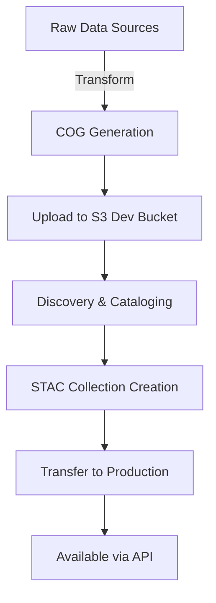

# Dataset Ingestion Using JSON Configuration Files

## Overview

This guide documents how the GHG Center ingests and manages geospatial datasets using JSON configuration files. The system uses a configuration-driven approach for transforming raw data into Cloud Optimized GeoTIFFs (COGs) and managing them through STAC (SpatioTemporal Asset Catalog) collections.

## Table of Contents
- [Configuration Types](#configuration-types)
- [Workflow Overview](#workflow-overview)
- [Configuration File Structure](#configuration-file-structure)
- [Transformation Pipeline](#transformation-pipeline)
- [Complete Examples](#complete-examples)
- [Best Practices](#best-practices)

## Configuration Types

The ingestion pipeline uses four main types of JSON configuration files:

### 1. Collection Configuration (`collections/*.json`)
Defines STAC collection metadata including spatial/temporal extents, licensing, and rendering parameters.

### 2. Dataset Configuration (`datasets/*.json`) 
Contains comprehensive dataset metadata, discovery patterns, and asset definitions.

### 3. Discovery Items Configuration (`discovery-items/*.json`)
Specifies how to discover and catalog individual data items from S3 buckets.

### 4. Transfer Configuration (`transfer-config/*.json`)
Manages data migration between S3 buckets (development to production).

## Workflow Overview



## Configuration File Structure

### Collection Configuration Example (ODIAC CO₂ Emissions)

```json
{
    "id": "odiac-ffco2-monthgrid-v2023",
    "type": "Collection",
    "title": "ODIAC Fossil Fuel CO₂ Emissions v2023",
    "extent": {
        "spatial": {
            "bbox": [[-180.00, -90.00, 180.00, 90.00]]
        },
        "temporal": {
            "interval": [["2000-01-01T00:00:00Z", "2022-12-31T00:00:00Z"]]
        }
    },
    "license": "CC-BY-4.0",
    "providers": [
        {
            "url": "https://www.nies.go.jp",
            "name": "National Institute for Environmental Studies",
            "roles": ["producer", "licensor"]
        }
    ],
    "description": "Monthly high-resolution global fossil fuel CO₂ emissions...",
    "item_assets": {
        "co2-emissions": {
            "type": "image/tiff; application=geotiff; profile=cloud-optimized",
            "roles": ["data", "layer"],
            "title": "Fossil Fuel CO₂ Emissions",
            "description": "Model-estimated monthly CO₂ emissions..."
        }
    },
    "stac_version": "1.0.0",
    "stac_extensions": [
        "https://stac-extensions.github.io/render/v1.0.0/schema.json",
        "https://stac-extensions.github.io/item-assets/v1.0.0/schema.json"
    ],
    "dashboard:is_periodic": true,
    "dashboard:time_density": "month",
    "renders": {
        "dashboard": {
            "assets": ["co2-emissions"],
            "colormap_name": "jet",
            "rescale": [[-10, 60]]
        }
    }
}
```

### Dataset Configuration Structure

```json
{
    "collection": "dataset-collection-id",
    "data_type": "cog",
    "spatial_extent": {
        "xmin": -180.0,
        "ymin": -90.0,
        "xmax": 180.0,
        "ymax": 90.0
    },
    "temporal_extent": {
        "startdate": "2000-01-01T00:00:00Z",
        "enddate": "2022-12-31T00:00:00Z"
    },
    "discovery_items": [
        {
            "discovery": "s3",
            "collection": "dataset-collection-id",
            "bucket": "ghgc-data-store-develop",
            "prefix": "transformed_cogs/dataset-name/",
            "filename_regex": ".*pattern.*.tif$",
            "datetime_range": "month",
            "assets": {
                "asset-name": {
                    "title": "Asset Title",
                    "description": "Asset description",
                    "regex": ".*pattern.*.tif$"
                }
            },
            "id_regex": ".*_(.*).tif$",
            "id_template": "collection-id-{}"
        }
    ],
    "is_periodic": true,
    "time_density": "month",
    "license": "CC-BY-4.0",
    "providers": [...],
    "renders": {...},
    "item_assets": {...}
}
```

### Discovery Items Configuration

```json
{
    "collection": "collection-id",
    "bucket": "ghgc-data-store",
    "prefix": "data-folder/",
    "filename_regex": ".*pattern.*.tif$",
    "datetime_range": "month",
    "assets": {
        "asset-name": {
            "title": "Asset Title",
            "description": "Asset description",
            "regex": ".*pattern.*.tif$"
        }
    },
    "id_regex": ".*_(.*).tif$",
    "id_template": "collection-id-{}"
}
```

### Transfer Configuration

```json
{
    "collection": "collection-id",
    "origin_bucket": "ghgc-data-store-develop",
    "origin_prefix": "transformed_cogs/dataset-name/",
    "target_bucket": "ghgc-data-store",
    "filename_regex": ".*pattern.*.tif$"
}
```

## Transformation Pipeline

### 1. Data Transformation Configuration

The transformation process is configured using a combination of:
- **Input specification**: Source data location and format
- **Processing parameters**: Reprojection, resampling, compression
- **Output configuration**: COG generation settings

Example transformation configuration embedded in notebook:

```python
config = {
    "data_acquisition_method": "s3",
    "raw_data_bucket": "source-bucket",
    "raw_data_prefix": "raw-data/",
    "cog_data_bucket": "ghgc-data-store-develop",
    "cog_data_prefix": "transformed_cogs/dataset-name",
    "transformation": {
        "reproject_to": "EPSG:4326",
        "compression": "DEFLATE",
        "predictor": 1,  # For float32/64 data
        "tiled": True,
        "blocksize": 512
    }
}
```

### 2. COG Profile Configuration

```python
# Standard COG profile
COG_PROFILE = {
    "driver": "COG",
    "compress": "DEFLATE",
}

# Float data COG profile (prevents predictor issues)
FLOAT_COG_PROFILE = {
    "driver": "COG",
    "compress": "DEFLATE",
    "predictor": 1,  # Explicitly set to NONE
    "zlevel": 6,
    "bigtiff": "YES",
    "tiled": True,
    "blockxsize": 512,
    "blockysize": 512
}
```

## Complete Examples

### Example 1: ODIAC Fossil Fuel CO₂ Emissions

**Use Case**: Monthly global CO₂ emissions data at 1km resolution

**Configuration Files**:
- Collection: Defines STAC collection with monthly temporal density
- Dataset: Specifies S3 discovery pattern for monthly TIFF files
- Discovery: Pattern matches files like `odiac2023_1km_202201.tif`
- Transfer: Moves processed COGs from dev to production

**Key Features**:
- Regular monthly updates (periodic dataset)
- Single asset type (co2-emissions)
- Jet colormap with rescale values for visualization
- Pattern-based file discovery using regex

### Example 2: EMIT Methane Plume Detection

**Use Case**: Irregular satellite observations of methane plumes

**Configuration Files**:
- Collection: Non-periodic collection with variable dates
- Dataset: Complex discovery for irregular temporal coverage
- Discovery: Matches individual plume detection files

**Key Features**:
- Non-periodic dataset (event-based)
- Plasma colormap for plume visualization
- Bilinear resampling for smooth rendering
- 60-meter spatial resolution

### Example 3: EPA CH₄ Emissions Grid

**Use Case**: Annual gridded methane emissions inventory

**Configuration Structure**:
```json
{
    "collection": "epa-ch4emission-yeargrid-v2express",
    "temporal_extent": {
        "startdate": "2012-01-01T00:00:00Z",
        "enddate": "2020-12-31T00:00:00Z"
    },
    "is_periodic": true,
    "time_density": "year",
    "discovery_items": [
        {
            "datetime_range": "year",
            "filename_regex": ".*epa_express_.*_\\d{4}.tif$",
            "id_template": "epa-ch4emission-yeargrid-v2express-{}"
        }
    ]
}
```

## Transformation Plugin Architecture

Transformation plugins are Python modules that handle dataset-specific processing:

```python
def dataset_transformation(file_obj, name, nodata):
    """
    Transform dataset from source format to COG
    
    Args:
        file_obj: S3 file object
        name: Original filename
        nodata: NoData value
        
    Returns:
        dict: COG filename -> data array mapping
    """
    # 1. Open and read data
    xds = xarray.open_dataset(file_obj)
    
    # 2. Coordinate transformation
    xds = xds.rename({"y": "latitude", "x": "longitude"})
    
    # 3. Process each variable
    var_data_netcdf = {}
    for var in variables:
        data = xds[var]
        # Apply transformations
        data.rio.write_crs("epsg:4326", inplace=True)
        data.rio.write_nodata(nodata, inplace=True)
        
        # Generate COG filename
        cog_filename = f"{var}_{date}.tif"
        var_data_netcdf[cog_filename] = data
    
    return var_data_netcdf
```

## Best Practices

### 1. Configuration Management
- Use version control for all configuration files
- Validate JSON syntax before deployment
- Document all regex patterns with examples
- Test discovery patterns on sample files

### 2. File Naming Conventions
- Include dataset name, variable, and date in filenames
- Use consistent date formats (YYYYMM or YYYYMMDD)
- Maintain original data versioning in filenames

### 3. Metadata Standards
- Provide comprehensive descriptions
- Include data sources and references
- Specify units and measurement details
- Document processing steps

### 4. S3 Organization
```
ghgc-data-store-develop/
├── transformed_cogs/
│   ├── dataset-name-v1/
│   │   ├── dataset_var_202201.tif
│   │   ├── dataset_var_202202.tif
│   │   └── metadata.json
│   └── dataset-name-v2/
└── checksums/
    └── dataset-name.json
```

### 5. Validation Steps
1. Validate COG format: `rio cogeo validate file.tif`
2. Check STAC compliance: Use pystac validation
3. Test discovery patterns: Run discovery script on sample
4. Verify visualization: Test render parameters
5. Calculate statistics: Generate and validate data stats

## API Integration

Once configured and ingested, datasets are accessible via:

### STAC API
```python
# Fetch collection metadata
GET https://earth.gov/ghgcenter/api/stac/collections/{collection-id}

# Search for items
GET https://earth.gov/ghgcenter/api/stac/search?collections={collection-id}
```

### Raster API
```python
# Get tile information
GET https://earth.gov/ghgcenter/api/raster/collections/{collection-id}/items/{item-id}/tilejson.json

# Fetch statistics
POST https://earth.gov/ghgcenter/api/raster/collections/{collection-id}/items/{item-id}/statistics
```

## Automation with DAG

The ingestion pipeline can be automated using Airflow DAGs:

1. **Transformation Task**: Apply transformation plugin
2. **Upload Task**: Transfer COGs to S3
3. **Discovery Task**: Catalog new items
4. **Validation Task**: Verify data integrity
5. **STAC Update**: Update collection metadata
6. **Transfer Task**: Move to production

## Troubleshooting

### Common Issues

1. **Regex Pattern Mismatches**
   - Test patterns with online regex tools
   - Verify file naming consistency
   - Check for special characters

2. **Temporal Extent Errors**
   - Ensure ISO 8601 format for dates
   - Verify timezone specification (use Z for UTC)

3. **Asset Discovery Failures**
   - Check S3 bucket permissions
   - Verify prefix paths exist
   - Test with smaller file sets

4. **COG Validation Errors**
   - Ensure proper compression settings
   - Check for predictor issues with float data
   - Validate projection information

## References

- [STAC Specification](https://stacspec.org/)
- [Cloud Optimized GeoTIFF](https://www.cogeo.org/)
- [GHG Center API Documentation](https://earth.gov/ghgcenter/api/)
- [GDAL COG Driver](https://gdal.org/drivers/raster/cog.html)